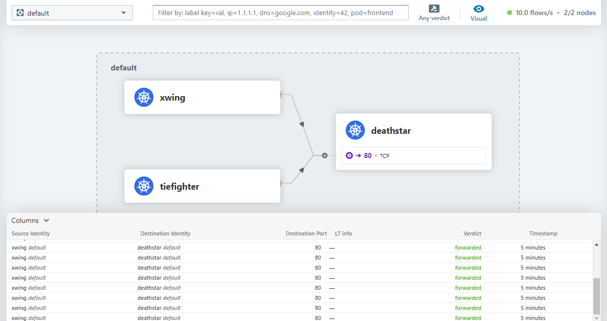

# Cilium Practice Scenario - Demo Setup

## Overview

This documentation outlines a demo setup for practicing network policies in Kubernetes using Cilium. The scenario is set within the 'Default Name Space' and models a scenario where various pods, representing different classes of services, require specific network access.

## Scenario Description

- **TIE Fighter Pod**: This pod is tagged with `Org-empire` and `Class-tiefighter` labels, indicating its role within our demo environment. It represents a client service that requires access to the 'Death Star' landing service.

- **X-Wing Pod**: Similarly labeled with `Org-empire` and `Class-xwing`, this pod mimics a client service from an alliance ship that might interact with other services within the namespace.

- **Death Star Deployment**: This deployemnt will create the deathstar with tow pod of image  docker.io/cilium/starwars with two lables

- **Death Star Service**: This service includes two pods under the `Org-empire` and `Class-deathstar` labels, and it offers landing services to client ships/pods.

==> You can find here the definition https://raw.githubusercontent.com/cilium/cilium/main/examples/minikube/http-sw-app.yaml

## Network Policies

- **L3/L4 Policy**: This foundational policy controls traffic at the IP address and port level, determining which pods can communicate with each other.

- **L7 Policy**: An advanced policy that operates at the application layer, allowing for more granular control based on HTTP methods and paths. In this setup:
  - The TIE Fighter pod is allowed to perform `HTTP POST` requests to `/v1/request-landing`.
  - The TIE Fighter pod is denied `HTTP PUT` requests to `/v1/exhaust-port`.

## Objectives

- Understand how Cilium manages and enforces network policies at different OSI model layers within a Kubernetes environment.
- Learn to differentiate between layer 3/4 policies that focus on IP addresses and ports, and layer 7 policies that allow detailed control over application-level operations.

By working through this scenario, practitioners will gain insight into the application of Cilium's network policies in a controlled environment that simulates real-world service interactions.

# We CAN see on the Hubble UI that the requests have been made with 'Verdict' forwareded

cilium service list
This command lists all services managed by Cilium within the Kubernetes cluster, showing how services are mapped to their backend pods. It displays:

ID: The unique identifier for each service.
Frontend: The IP address and port number that clients use to access the service. This acts as the "virtual" address for the service.
Service Type: Indicates the type of service, such as ClusterIP (internal cluster address) or NodePort (external port accessible outside the cluster).
Backend: Lists the actual pod IP addresses and ports that serve the traffic for this service. The (active) status indicates that these backends are currently available to receive traffic.
ID    SVC                 TYPE SVC            POD IPs
7    172.17.63.168:8080   ClusterIP      1 => 172.16.1.139:8080  (active)   
                                         2 => 172.16.1.115:8080 (active)   
                                         3 => 172.16.1.132:8080 (active)   
                                         4 => 172.16.1.200:8080 (active)   

cilium bpf lb list
This command shows the load balancing rules stored in the eBPF maps, detailing how incoming service requests are distributed across multiple backend pods:

SERVICE ADDRESS: The address (IP and port) of the service being accessed.
BACKEND ADDRESS (REVNAT_ID) (SLOT): The IP addresses and ports of the backend pods serving the service. The REVNAT_ID is an identifier used for reverse NAT (Network Address Translation) operations, and SLOT indicates the position of the backend in the load balancing rotation.
SVC                  route table: PODS IPs REVNAT_ID SLOT
172.17.14.177:8000   0.0.0.0:0 (13) (0) [ClusterIP, non-routable]
                     172.16.1.237:8000 (13) (1)
0.0.0.0:31214        172.16.1.132:8080 (9) (3)
                     172.16.1.115:8080 (9) (2)
                     172.16.1.200:8080 (9) (4)
                     0.0.0.0:0 (9) (0) [NodePort, non-routable]
                     172.16.1.139:8080 (9) (1)

cilium bpf fs show
This command provides information about the eBPF filesystem mount, which is crucial for Cilium's operation. The eBPF filesystem (/sys/fs/bpf) is where Cilium stores eBPF programs and maps. The output includes:

MountID and ParentID: Identifiers for the mount point in the Linux filesystem hierarchy.
Mounted State: Indicates whether the eBPF filesystem is currently mounted (true).
MountPoint: The location where the eBPF filesystem is mounted.
MountOptions and SuperOptions: Configuration options for the filesystem, including read/write permissions and security settings.
WHERE TO SAVE the data and configs:

MountID:          1680
ParentID:         1669
Mounted State:    true
MountPoint:       /sys/fs/bpf
MountOptions:     rw,nosuid,nodev,noexec,relatime
OptionFields:     [master:11]
FilesystemType:   bpf
MountSource:      bpf
SuperOptions:     rw,mode=700

cilium bpf tunnel list
This command displays the IPsec or VXLAN tunnels Cilium uses for secure and efficient pod-to-pod communication across different nodes in the cluster:

TUNNEL: The IP address of the tunnel endpoint, representing the overlay network's endpoint for a particular node.
VALUE: The node's IP address that the tunnel endpoint connects to. The :0 indicates that this is for encapsulated traffic, not direct traffic to a specific port.

MASTER NODE
TUNNEL       VALUE
172.16.1.0   10.0.0.11:0
 and the  172.16.1.0/16 is pod_cidr and 10.0.0.11 is IP in the HOST MASTER NODE
WORKER NODE
TUNNEL       VALUE
172.16.0.0   10.0.0.10:0  
  10.0.0.10 is IP in the HOST WORKER NODE
